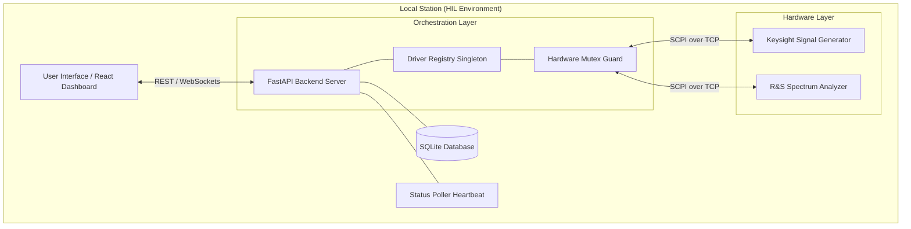

# RangeReady RF v6.0 - System Architecture & Engineering Logic

> [!CAUTION]
> **CONFIDENTIAL AND PROPRIETARY SOFTWARE**  
> This engineering design and its implementation are the exclusive property of **GVB Tech**. For internal use in private repositories only.

## 1. Software Stack Overview
The RangeReady platform is built using industry-standard Components designed for reliability and high performance in automated test environments.

### Backend (Industrial Orchestration Engine)
- **Language**: Python 3.12+
- **Web Framework**: FastAPI (Asynchronous REST API)
- **Persistence**: DriverRegistry Singleton (Persistent Socket Management)
- **Safety Layer**: Deterministic Hardware Mutex (Serialized Access)
- **Instrumentation Communication**: Raw TCP/SCPI Bridge with **SCPI Sentry** resilience layer.
- **SCPI Negotiation Engine**: A 3-tier safety execution pipeline (Retry -> Fallback -> Heal) for high-stakes instrumentation.
- **Data Processing**: NumPy (Digital Signal Processing & Trace Analysis)
- **Database**: SQLite with SQLAlchemy ORM (Station Metadata & Test History)
- **Real-time Synchronization**: WebSockets (Broadcast Service for live telemetry & Interlocks)

---

## 2. System Architecture (V6.0)
The system follows a hardened **Client-Registry-Hardware** architecture designed for sub-millisecond command dispatch.

---

## 3. Core Capabilities (V6.0)
- **Deterministic Hardware Mutex**: Every hardware-mutating command is wrapped in a global `lock_and_broadcast` guard. This ensures only one command is processed by an instrument at any time, preventing internal bus collisions.
- **Persistent Socket Management**: The `DriverRegistry` maintains active, warm sockets for all instruments. This eliminates the 50-100ms connection overhead for every command, enabling ultra-low latency control.
- **The SCPI Sentry (Resilience Pipeline)**:
    - **Tier 1 (Transient Retry)**: Sophisticated exponential backoff handler for dropped packets and bus timeouts.
    - **Tier 2 (Protocol Fallback)**: Intelligent mapping of manufacturer-rejected commands to IEEE 488.2 standard SCPI headers.
    - **Tier 3 (AI Healing)**: Real-time command rectification via the Apex AI engine, correcting syntax anomalies without operator intervention.
- **Intelligent Auto-Discovery**: Automated network bus interrogation (Port 5025) with recursive identification, now supporting cross-subnet and APIPA scanning.

---

## 4. Operational Flow
The typical execution cycle for high-speed hardware control follows this path:

1. **Guard Acquisition**: The backend attempts to acquire the per-instrument mutex lock with a 10s safety timeout.
2. **State Broadcast**: Upon lock acquisition, a `hardware_state` update is broadcast via WebSockets to all connected clients, activating the UI interlock overlay.
3. **Dispatch**: The command is dispatched through the persistent singleton socket in the `DriverRegistry`.
4. **Validation/Telemetry**: The command response or trace data is captured and validated.
5. **Guard Release**: The mutex is released, and the "Ready" state is broadcast to the UI, restoring control interactivity.
