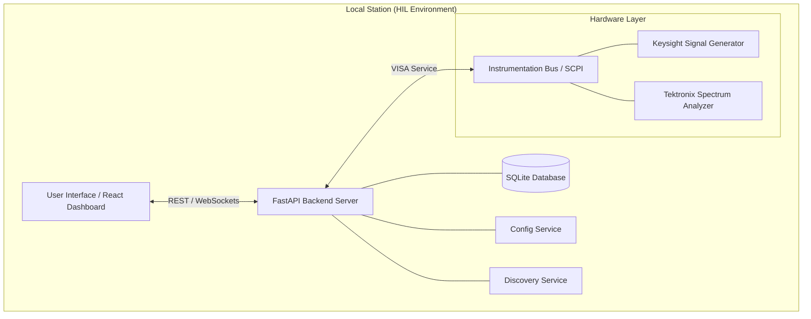

# RangeReady RF - System Architecture & Engineering Specifications

## 1. Software Stack Overview
The RangeReady platform is built using industry-standard, production-grade software components to ensure reliability and high performance in automated test environments.

### Backend (Intelligence Engine)
- **Language**: Python 3.12+
- **Web Framework**: FastAPI (Asynchronous REST API)
- **Instrumentation Communication**: PyVISA (VXI-11 / TCPIP / USB / GPIB)
- **Data Processing**: NumPy (Digital Signal Processing & Trace Analysis)
- **Database / Registry**: SQLite with SQLAlchemy ORM (Station Metadata & Test History)
- **Real-time Synchronization**: WebSockets (Broadcast Service for live telemetry)

### Frontend (User Interface Layer)
- **Framework**: React 18+
- **Build Tool**: Vite (Ultra-fast HMR)
- **Styling**: Vanilla CSS + Tailwind CSS (Industrial Design System)
- **Animations**: Framer Motion (State Transitions & Liquid Glass Effects)
- **Iconography**: Phosphor Icons (Laboratory Standard sets)

---

## 2. System Architecture
The system follows a decoupled **Client-Server-Instrument** architecture designed for low-latency hardware orchestration.

---

## 3. Core Capabilities
- **Zero-Click Initialization**: Automated environment provisioning for Windows (`.bat`) and Fedora/Linux (`.sh`).
- **Intelligent Auto-Discovery**: Automated subnet scanning (Port 5025) with recursive `*IDN?` handshaking for instrument identification and role assignment.
- **Hardware-in-the-Loop (HIL)**: Direct SCPI communication with professional-grade laboratory equipment.
- **Actionable Error Matrix**: Real-world fault detection that provides specific physical troubleshooting steps (e.g., "Check LAN Connection") directly in the GUI.
- **Traceability**: Full logging of every SCPI command sent over the bus for audit trails and debugging.

---

## 4. Operational Flow
The typical execution cycle for an automated RF test follows this deterministic path:

1. **System Ignition**: User runs `INIT_READY`. The script activates the virtual environment, starts the FastAPI server, and launches the React dashboard.
2. **Resource Mapping**: User triggers "Discovery" from the Settings page. The **Discovery Service** scans the network, identifies the manufacturer (Keysight/Tektronix), and maps them to their respective roles (Signal Generator/Spectrum Analyzer).
3. **Sequence Loading**: User selects a Test Template (e.g., `KEYSIGHT_TEK_SUITE`).
4. **Target Engagement**: User clicks "Engage Target". The **Sequence Engine** parses the template into instrument-specific SCPI commands.
5. **Hardware Orchestration**: Commands are dispatched via the **VISA Service** over the network bus.
6. **Telemetry Broadcast**: Raw trace data is captured, processed via **NumPy**, and streamed to the UI via **WebSockets** for real-time visualization.
7. **Report Archival**: Upon completion, results are persisted in the **SQLite Database** and formatted into professional reports.
